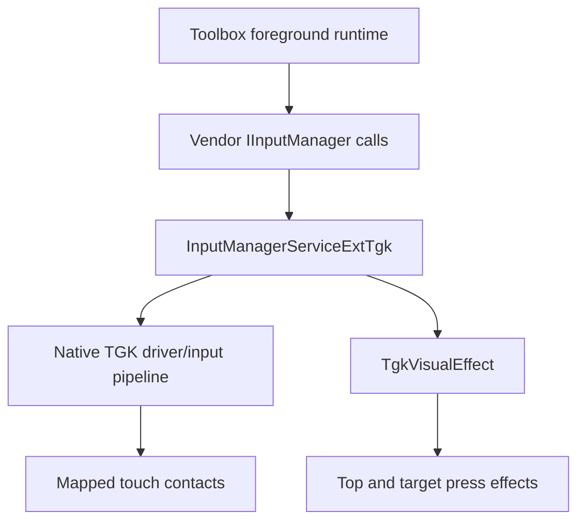
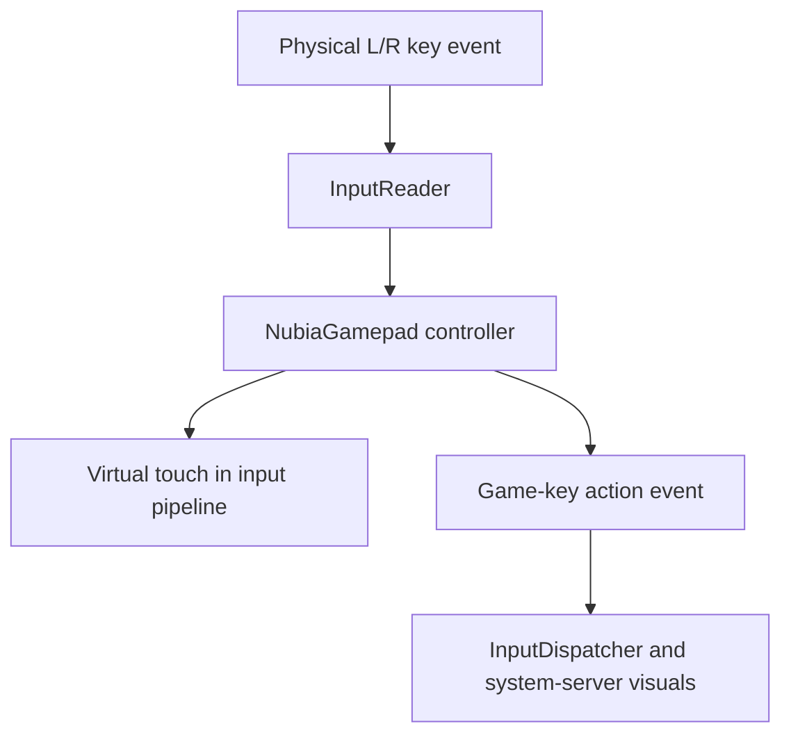

# REDMAGIC NX809J native TGK reverse engineering

## Executive summary

The RedMagic 11 Pro / NX809J implements shoulder-trigger-to-touch mapping inside REDMAGIC's modified Android input stack. The stock Game Space application is a configuration client; it is not the component that synthesizes each touch.

On the tested Android 16 firmware, an ordinary application UID can configure the vendor TGK extensions exposed by `IInputManager`. Once configured, physical shoulder events are converted into touch contacts downstream of the Linux touchscreen event stream. This preserves real multitouch and avoids the cancellation and pointer-contention problems produced by accessibility gestures, `input tap`, touchscreen `sendevent`, or a virtual gamepad.

Redmagic 11 Toolbox therefore stores its own per-package profiles, programs the stock input service when a selected application becomes foreground, and disables TGK immediately when that application loses focus. Game Space may remain installed, but its application process and database are not runtime dependencies.

`TGK` is not expanded in a public API contract. REDMAGIC's framework class names—including `TouchGameKeyMapHelper`, `TouchGameKeyVisionController`, and the `touchgamekey` package—identify it as the firmware's **Touch Game Key** subsystem.

## Scope and tested firmware

| Item | Value |
|---|---|
| Device | REDMAGIC 11 Pro / NX809J |
| Android | 16 / SDK 36 |
| Firmware fingerprint | `REDMAGIC/NX809J-UN/NX809J:16/BQ2A.250705.001-BP2A.250605.031.A3/20260408.075725:user/release-keys` |
| Trigger key codes | Middle `136`, left `137`, right `138` |
| Reference game | `com.activision.callofduty.shooter` |
| Logical landscape size observed | approximately `2688 × 1216` |

These findings are firmware-specific. Transaction numbers are additions to this REDMAGIC build's `IInputManager` ABI and must not be assumed to exist on AOSP, LineageOS, another REDMAGIC generation, or another firmware revision.

## Evidence set

The investigation used locally extracted or device-produced material supplied by the device owner:

- REDMAGIC framework and `services.jar` archives
- Split Game Space core archives
- `GamePi.apk`
- `GameAssist.apk`
- `GamePluginTrigger.apk`
- `redmagic_stock_tgk_trace.txt`
- `redmagic_tgk_binder_states.txt`
- Runtime Binder monitoring and direct `service call input` experiments
- Root-only inspection of the stock Game Space and TGK content providers
- A device-side native-library capture containing `libandroid_servers.so`,
  `libinputflinger.so`, `libinputflinger_base.so`, and `libinputreader.so`
- ELF dependency, dynamic-symbol, and embedded-string inspection of those
  four libraries

The proprietary firmware archives and APKs are not redistributed in this repository. This document records the interoperability findings and the behavior independently confirmed on owned hardware.

## What the framework revealed

The Android framework contains REDMAGIC additions to `android.hardware.input.IInputManager` and `android.hardware.input.InputManager`. The system-server side is implemented by classes under:

```text
com.android.server.redmagic.game.touchgamekey
```

The most relevant classes were:

- `InputManagerServiceExtTgk`
- `PhoneWindowManagerExtTgk`
- `TouchGameKeyMapHelper`
- `TouchGameKeyVisionController`
- `TgkVisualEffect`
- `TgkAllSceneManager`

`InputManagerServiceExtTgk` owns global, per-trigger, haptic, link-function, driver, point, mode, and visual state. `PhoneWindowManagerExtTgk` recognizes the built-in trigger key events, coordinates haptics and visual feedback, and treats internal key codes 137 and 138 specially. `TgkVisualEffect` creates and removes stock system-server-owned views for trigger-down and trigger-up feedback.

The application-facing control path is:



The application configures state on foreground entry. It does **not** inject one command for every physical trigger press.

## What the native libraries revealed

The native-library capture located the TGK implementation below the Java
framework and confirmed that it is integrated into Android's core input
pipeline. REDMAGIC did not isolate the feature in a small, independently
loadable library such as `libtgk.so`. Instead, related code and ABI additions
span four platform libraries:

| Native library | Confirmed TGK responsibility |
|---|---|
| `libandroid_servers.so` | Registers the system-server JNI methods for TGK configuration and carries the native callback into Java policy code. |
| `libinputreader.so` | Contains the large `android::NubiaGamepad` implementation and the `InputReader` entry points that configure and generate virtual touch behavior. |
| `libinputflinger_base.so` | Adds `NotifyGameKeyActionChangedArgs` and `NotifyMotionCollectionArgs` to the native input-listener event variant. |
| `libinputflinger.so` | Propagates the added game-key event through the input filter, processor, pointer choreographer, interaction blocker, dispatcher, metrics, and latency layers. |

`libandroid_servers.so` exposes or embeds the JNI registration names used by
`NativeInputManagerService.NativeImpl`, including:

```text
releaseTgk
setConsumeTgkKey
setLTgkEnabled
setMTgkEnabled
setRTgkEnabled
setTgkMode
setTgkPoint
setTgkRapidFireCount
setTgkVersion
virtualTouchEvent
```

It also exports
`android::NativeInputManager::notifyGameKeyActionChanged(...)`, connecting the
native trigger state back to the system-server visual-feedback path.

The decisive implementation evidence is in `libinputreader.so`. Its dynamic
symbols identify `android::NubiaGamepad` and expose substantial routines for:

- Recognizing TGK keys and consuming their physical key events
- Enabling the left, right, and middle triggers
- Setting TGK version, point rectangles, behavior mode, and rapid-fire count
- Generating, clearing, resetting, and repeating virtual-touch events
- Processing continuous clicks or movement
- Handling joystick, sensor, camera-key, and casting-related virtual-touch modes
- Reporting trigger down/up state through `notifyGameKeyActionChanged(...)`

Representative exported functions include
`NubiaGamepad::virtualTouchEvent(...)`,
`NubiaGamepad::resetVirtualTouchEvent()`,
`NubiaGamepad::continuousClicksOrMoveVirtualTouchEvent()`,
`NubiaGamepad::setTgkPoint(...)`, and `NubiaGamepad::setTgkMode(...)`.
`InputReader` itself exposes corresponding TGK entry points, demonstrating that
the controller is integrated with the reader rather than implemented by Game
Space or by a separate application-facing daemon.

The event ABI is also vendor-modified. `libinputflinger_base.so` adds
`NotifyGameKeyActionChangedArgs` to the `std::variant` carried by
`InputListenerInterface`, `QueuedInputListener`, and `TracedInputListener`.
`libinputflinger.so` then implements matching handlers in `InputFilter`,
`InputProcessor`, `PointerChoreographer`, `UnwantedInteractionBlocker`, and
`InputDispatcher`. This native event is the bridge between physical trigger
state and the framework-owned pressed-target and edge effects.

No captured library declared a dependency on a separate TGK-specific shared
object. The evidence therefore supports this native path:



This independently explains both important runtime observations: TGK contacts
do not appear as new Linux touchscreen slots, and trigger down/up can still
drive stock visual feedback in system_server.

### Why the stock binaries are not a portable TGK package

Copying these `.so` files into an AOSP or LineageOS build is not a safe shortcut.
The vendor changed private C++ interfaces and the input-listener event variant,
so the libraries form a tightly coupled set whose ABI must match the exact
framework build. Replacing only `libinputreader.so` would leave its required
listener types and callbacks missing. Replacing the inputflinger libraries as
a group would still require matching JNI, Java APIs, policy code, resources,
and device policy. Replacing the much broader `libandroid_servers.so` risks
breaking unrelated system-server JNI services and can prevent Android from
booting.

A custom-ROM port should consequently be a source-level, clean-room
reimplementation of the required subset, not a transplant of proprietary
stock binaries. The minimum port spans `frameworks/base` and
`frameworks/native`: the public/system Binder surface, InputManagerService JNI,
an InputReader-side TGK controller, native event propagation for pressed-state
feedback, and the relevant device SELinux and product configuration. Preserving
the confirmed transaction ABI would allow the Toolbox's existing native TGK
client to operate unchanged.

The symbol coverage makes such a port technically feasible, but it is not a
short framework patch. A minimal L/R implementation would still be a
multi-week native-input project, followed by on-device validation of
multitouch, rotation, simultaneous triggers, rapid fire, lifecycle cleanup,
visual callbacks, and SELinux policy.

## Confirmed Binder transaction map

The following transaction numbers were recovered from the firmware's generated `IInputManager.Stub` and correlated with runtime behavior:

| Transaction | Framework method | Purpose |
|---:|---|---|
| 100 | `setGlobalKeyEnable(boolean)` | Global TGK enable |
| 101 | `setConsumeTgkKey(boolean)` | Consume mapped physical key events |
| 102 | `setLeftGameKeyEnable(boolean)` | Enable left trigger |
| 103 | `setRightGameKeyEnable(boolean)` | Enable right trigger |
| 104 | `setMiddleGameKeyEnable(boolean)` | Enable middle trigger |
| 105 | `setTouchHapticFeedbackEnable(boolean)` | Native trigger haptics |
| 106 | `setGameRightKeyLinkFunction(int)` | Right linked function |
| 107 | `getGameRightKeyLinkFunction()` | Read right linked function |
| 108 | `setGameLeftKeyLinkFunction(int)` | Left linked function |
| 109 | `getGameLeftKeyLinkFunction()` | Read left linked function |
| 110 | `setGameMiddleKeyLinkFunction(int)` | Middle linked function |
| 111 | `getGameMiddleKeyLinkFunction()` | Read middle linked function |
| 112 | `isGlobalKeyEnable()` | Read global state |
| 113 | `isLeftGameKeyEnable()` | Read left state |
| 114 | `isShowTgkView()` | Read TGK view state |
| 115 | `showTgkView(boolean)` | Set TGK view state |
| 116 | `isRightGameKeyEnable()` | Read right state |
| 117 | `isMiddleGameKeyEnable()` | Read middle state |
| 118 | `isTouchHapticFeedbackEnable()` | Read haptic state |
| 126 | `setKeyTouchPoint(...)` | General key-to-touch point interface |
| 127 | `virtualTouchEvent(...)` | Vendor virtual-touch event interface |
| 142 | `setTgkVersion(int)` | Select TGK compatibility/version behavior |
| 143 | `setTgkMode(int, int)` | Set behavior mode for a trigger key code |
| 144 | `setTgkRapidFireCount(int, int)` | Set rapid-fire count |
| 145 | `setTgkPoint(int[], int[], int)` | Set the two point rectangles for a trigger |
| 146 | `enableTgkDrive(boolean)` | Enable/disable the TGK driver for L/R |
| 147 | `enableLeftTgkDrive(boolean)` | Left driver control |
| 148 | `enableRightTgkDrive(boolean)` | Right driver control |
| 149 | `releaseTgk()` | Release/reset TGK state |
| 150 | `setTgkSensitivity(int, int)` | Per-trigger TGK sensitivity |
| 151 | `setTgkTopEffectEnable(boolean)` | Physical-edge press highlight |
| 152 | `setTgkCenterEffectEnable(boolean)` | Mapped-target press effect |
| 153 | `setTgkTransparency(int)` | Native effect alpha, `0–100` |
| 154 | `showTgkToast(String)` | Stock TGK toast |

Redmagic 11 Toolbox uses only the subset required for confirmed mapping, state verification, rapid fire, haptics, driver activation, and visual feedback. Transactions 126, 127, 147–150, and 154 are documented for completeness but are not needed by the current standalone mapping path. Transaction 149 is deliberately avoided in the normal lifecycle because testing established a reliable, less disruptive explicit disable/reconfigure sequence.

## Point encoding and the two rectangles

`setTgkPoint` accepts two integer arrays and a trigger key code. Direct Binder calls use Android's raw `int[]` Parcel encoding:

```text
i32 4
i32 left i32 top i32 right i32 bottom
i32 4
i32 left2 i32 top2 i32 right2 i32 bottom2
i32 keyCode
```

The stock Call of Duty profile exposed these values:

| Trigger | First rectangle | Second rectangle |
|---|---|---|
| Left / 137 | `2398,638,2475,715` | `216,540,300,624` |
| Right / 138 | `2353,880,2430,957` | `1140,540,1224,624` |

The framework's `TgkVisualEffect` stores two points per trigger and selects one or both according to mode. Game Space's database also records landscape state. The exact historical meaning assigned by Game Space to both rectangle slots was not required for the initial independent implementation: testing proved that duplicating the user-selected rectangle into both arrays works in normal and reverse landscape. This removes reliance on undocumented Game Space orientation-slot policy while preserving the firmware API's expected shape.

Redmagic 11 Toolbox stores rectangles with the display dimensions at capture time and scales them to the current logical display dimensions before programming TGK. Portrait and landscape mappings are stored separately.

## Stock databases and application responsibilities

Two stock providers were identified:

| Data | Provider |
|---|---|
| Game list | `content://cn.nubia.gamelauncher.db.AppAddProvider/appadd` |
| TGK presets | `content://cn.nubia.tgk.data.TgkDataProvider/preset_case_table` |

The stock Call of Duty row had an active case with `state=7`, `main_sw=1`, left and right enabled, middle disabled, and landscape enabled. The coordinate strings contained the two rectangles shown above.

Running Android's shell `content` command as an ordinary UID failed because that command obtains providers externally and requires `ACCESS_CONTENT_PROVIDERS_EXTERNALLY`. Root queries succeeded. That result does not prove a normal application's in-process `ContentResolver` access is denied, but database access ultimately proved unnecessary.

The split Game Space components showed the expected division of responsibility: application code stores and selects TGK profiles and calls vendor input APIs, while framework/system-server code observes trigger events and controls the native mapping and visual effects. `GameAssist` starts the TGK service intent (`cn.nubia.tgk.TGKSERVICE`), but the successful isolated test established that the Game Space applications do not need to remain running after the framework is configured directly.

`GamePluginTrigger.apk` primarily contains AI/screen-content trigger policy rather than the low-level L/R touch injection engine. The decisive mapping implementation is in the framework and system-server input extensions.

## Ordinary application UID access

Termux was running in the ordinary untrusted application domain:

```text
u:r:untrusted_app:s0
```

Without `su`, it successfully:

- Read transactions 112, 113, 116, 117, and 118.
- Changed haptic state through transaction 105.
- Changed left and right state through transactions 102 and 103.
- Changed global TGK state through transaction 100.
- Read every changed value back successfully.
- Restored all values to disabled.

Setter replies were `Parcel(NULL)`, while getter replies contained the expected Boolean integer. This demonstrates that the tested firmware does not enforce an effective signature or root permission check on these TGK methods for an ordinary app UID.

Redmagic 11 Toolbox attempts the direct Binder-compatible service path first and retains reflection as a secondary vendor-API backend. Root is not used for native TGK configuration.

## Dynamic runtime sequence

A live Binder monitor captured the stock lifecycle:

| State | Global | Left | Right | Middle | Haptic |
|---|---:|---:|---:|---:|---:|
| Outside game | 0 | 0 | 0 | 0 | 0 |
| Call of Duty active | 1 | 1 | 1 | 0 | 1 |
| After leaving | 0 | 0 | 0 | 0 | 0 |

Game Space briefly cycled haptics during shutdown before disabling the remaining state.

The reliable independent activation sequence discovered on NX809J is:

1. Explicitly disable the previous mapping state.
2. Enable the TGK driver with transaction 146.
3. Set TGK version 40 with transaction 142.
4. Send the L point with transaction 145.
5. Send the L mode with transaction 143 and rapid-fire count with 144 when applicable.
6. Repeat point, mode, and optional count for R.
7. Wait two seconds for the asynchronous vendor point/mode work to settle.
8. Optionally enable stock visual effects with transactions 151–153.
9. Enable key consumption, haptics, left, right, and global TGK in this order: `101 → 105 → 102 → 103 → 100`.
10. Wait one second and verify transactions 112, 113, 116, and 118.

The settle delay is functional, not cosmetic. Immediate activation could be overwritten by delayed vendor work. The final driver/version/settle sequence was restored after experiments with transaction 149 disturbed the previously working behavior.

Shutdown explicitly disables the driver, global TGK, L, R, haptics, and key consumption. Disabling global TGK also causes `TgkVisualEffect.noteGameKeyEnable(false)` to remove all stock views and reset its down-state tracking.

## Why multitouch remains intact

The kernel input trace contained only three genuine touchscreen contacts. Every genuine contact stayed in kernel touchscreen slot 0. One finger remained continuously down for 22.87 seconds while 247 physical F7/F8 trigger edges occurred.

During those trigger edges:

- No additional kernel `ABS_MT_TRACKING_ID` appeared.
- The held touchscreen contact was never cancelled.
- Call of Duty thumbstick movement remained uninterrupted.
- L and R still activated their mapped actions.

Therefore the mapped contacts are not written back into the touchscreen evdev device. They are inserted downstream inside Android's native input path. This explains why the stock system and Redmagic 11 Toolbox can add trigger contacts without taking ownership of the user's existing finger stream.

## Game Space-independent proof

The following packages were force-stopped:

```text
cn.nubia.gamelauncher
cn.nubia.gamepi
cn.nubia.gameassist
```

From the ordinary Termux UID, the experiment then:

1. Sent duplicated Call of Duty L/R rectangles through transaction 145.
2. Sent single-touch mode through transaction 143.
3. Waited for configuration to settle.
4. Enabled transactions 101, 105, 102, 103, and 100.
5. Verified all corresponding getters returned enabled.
6. Launched Call of Duty directly rather than through Game Space.
7. Tested normal landscape and reverse landscape.
8. Disabled and verified every state afterward.

Observed result:

- L and R activated their intended Call of Duty actions.
- Thumbstick movement remained uninterrupted.
- Rotation worked in both landscape directions.
- Cleanup returned all observed state to zero.

This is the decisive proof that Game Space is not a runtime requirement. The proprietary firmware TGK engine remains required.

## Native visual feedback

`PhoneWindowManagerExtTgk.interceptKeyBeforeQueueingExt` forwards physical trigger down/up state to the TGK vision and visual-effect controllers. `TgkVisualEffect` then provides two separate visual layers:

- The top effect is added near the physical trigger edge on down and removed on up.
- The center effect is added at the programmed TGK point on down and removed on up.

For a normal single target, the path is `processDown()` → `addCenterOneView()` and `processUp()` → `removeCenterOneView()`. The view is created by system_server with the point previously supplied through transaction 145. Transaction 153 converts its integer value to window alpha as `value / 100.0`, so 100 is fully visible.

Redmagic 11 Toolbox enables transactions 151, 152, and 153 as best-effort presentation calls. Failure of an optional visual API never prevents the proven touch-mapping path from enabling. The application's own saved markers remain nearly transparent and non-interactive; the framework-owned center effect supplies the bright held-press indication.

## Foreground ownership and overlays

Early prototypes exposed a lifecycle problem: an editor or saved-target overlay could outlive the selected game, reappear after rotation in another application, or fail to reapply TGK when a game returned to the foreground.

The final design uses one foreground owner for all per-app gaming features. The authoritative stock-firmware signal is `topResumedActivity`, with Usage Events as a fallback when accessibility events are ambiguous. Editor overlays, saved TGK targets, native mapping state, refresh-rate overlay, touch tuning, and performance mode now follow that same owner.

Rules enforced by the runtime:

- Editor controls exist only during explicit placement or re-editing.
- Saved targets are non-interactive and only visible over their selected foreground package.
- Returning to a selected application reapplies native TGK immediately.
- Leaving, closing, screen-off, service shutdown, or loss of a complete orientation mapping disables TGK and removes related overlays.
- Orientation changes select the matching portrait or landscape layout.

## Compatibility boundary

Native TGK depends on more than Java method declarations. A compatible ROM needs the matching pieces across:

- Framework `InputManager` and `IInputManager` additions
- InputManagerService/system-server TGK extensions
- Window-policy trigger handling
- Native input implementation and vendor driver behavior
- REDMAGIC resources used by system visual effects
- Device nodes, vendor libraries, feature flags, and SELinux policy

Native ELF analysis confirms that these requirements are concrete rather than
architectural speculation: TGK changes the InputReader implementation, the
input-listener event ABI, InputDispatcher propagation, and system-server JNI.

An app can detect and call these APIs when they exist, but it cannot recreate the downstream native contact injection on a ROM that removed the firmware implementation. A LineageOS port would need to forward-port or independently reimplement the complete framework/native/vendor path with appropriate legal permission and device-specific validation.

For that reason, Redmagic 11 Toolbox gates TGK and every other stock-only gaming API independently. General NX809J features remain available on compatible custom ROMs when their kernel/vendor interfaces survive, while unavailable stock services are not presented as working.

## Implementation principles

The production implementation follows these rules:

- Preserve the stock driver/version/point/mode/settle/enable sequence.
- Never inject a shell command for each trigger press.
- Never replace native TGK with accessibility gestures, `input tap`, touchscreen `sendevent`, or uinput gamepads.
- Keep optional visual effects best-effort.
- Verify enabled state after application and disabled state after cleanup.
- Store profiles locally by package, orientation, and named layout.
- Scale saved rectangles from capture dimensions to current logical dimensions.
- Keep the application ID and backup format stable across rebranding.
- Use root only for unrelated hardware interfaces that actually require it.

## Result

The investigation converted TGK from a Game Space-bound feature into a documented, independently configurable firmware capability. On the tested NX809J build, Redmagic 11 Toolbox can reproduce stock-quality L/R touch mapping, haptics, rapid fire, edge highlights, mapped-target press visuals, rotation handling, and preserved multitouch without keeping the Game Space application running and without root for TGK itself.
